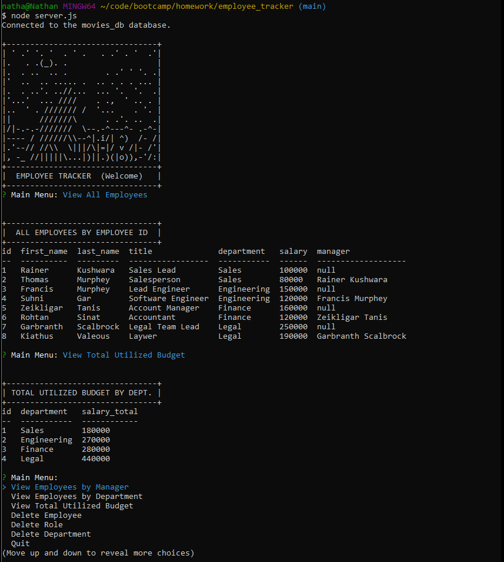

# employee_tracker
## Table of Contents
- [Description](#description)
- [User Story](#user-story)
- [Acceptance Criteria](#acceptance-criteria)
- [Table of Contents](#table-of-contents)
- [Installation](#installation)
- [Usage](#usage)
- [Tests](#tests)
- [Questions](#questions)


## Description
  
A node.js application that prompts used from inquirer to a list of commands that access a MYSQL database. The application contains server functions that allow the user to view, update, add, and delete in order to maintain an employee DATABASE with employee, role, and department tables.
The list of commands include:

- 'View All Employees'
- 'Add Employee'
- 'Update Employee Role'
- 'Update Employee Manager'
- 'View All Roles'
- 'Add Role'
- 'View All Departments'
- 'Add Department'
- 'View Employees by Manager'
- 'View Employees by Department'
- 'View Total Utilized Budget'
- 'Delete Employee'
- 'Delete Role'
- 'Delete Department'

This application uses jobSite_db.

</br></br></br></br></br>[CLICK HERE -- The file showing full functionality of the application](https://youtu.be/oLNy2bzSvqQ)  
  


## User Story
  
```
AS A business owner
I WANT to be able to view and manage the departments, roles, and employees in my company
SO THAT I can organize and plan my business
```
  

## Acceptance Criteria
  
``` 
GIVEN a command-line application that accepts user input
WHEN I start the application
THEN I am presented with the following options: view all departments, view all roles, view all employees, add a department, add a role, add an employee, and update an employee role
WHEN I choose to view all departments
THEN I am presented with a formatted table showing department names and department ids
WHEN I choose to view all roles
THEN I am presented with the job title, role id, the department that role belongs to, and the salary for that role
WHEN I choose to view all employees
THEN I am presented with a formatted table showing employee data, including employee ids, first names, last names, job titles, departments, salaries, and managers that the employees report to
WHEN I choose to add a department
THEN I am prompted to enter the name of the department and that department is added to the database
WHEN I choose to add a role
THEN I am prompted to enter the name, salary, and department for the role and that role is added to the database
WHEN I choose to add an employee
THEN I am prompted to enter the employee’s first name, last name, role, and manager, and that employee is added to the database
WHEN I choose to update an employee role
THEN I am prompted to select an employee to update and their new role and this information is updated in the database
```


## Installation 
Run the following commands at the project root directory.</br></br>- `npm i`</br>- Configure the .env file </br>- Run Mysql: SOURCE db/schema.sql, db/seeds.sql
  

## Usage 
This application uses dotenv, which requires mysql log-in information in the .env </br> The schema.sql uses jobSite_db </br>
Run the following commands at the project root directory</br></br>`node server.js`


## Tests
No tests included.


## Questions
[Nathan Patnaude](mailto:Nathanpatnaude@gmail.com) , [GitHub Account](https://github.com/Nathanpatnaude)<br />
This Project is on [GitHub](https://github.com/Nathanpatnaude/employee_tracker)
User Story
